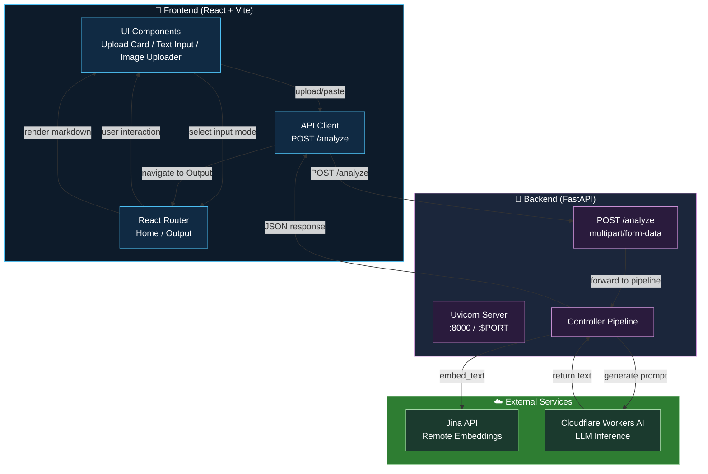
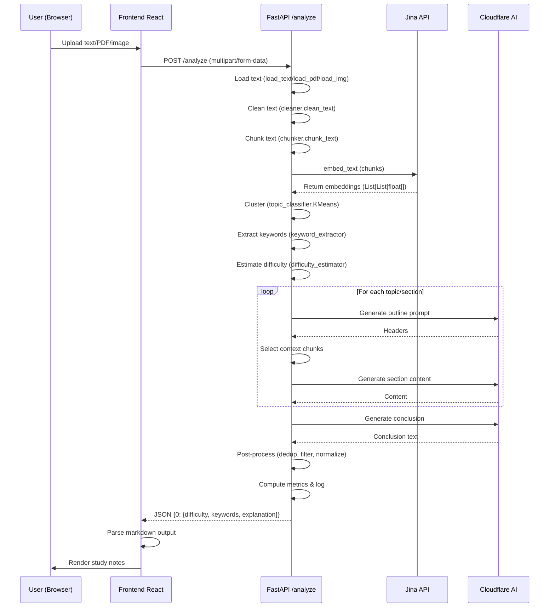
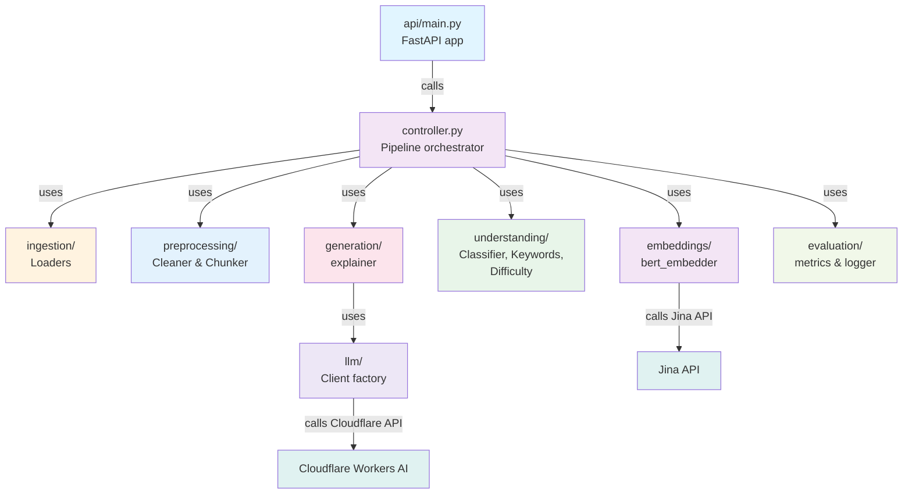
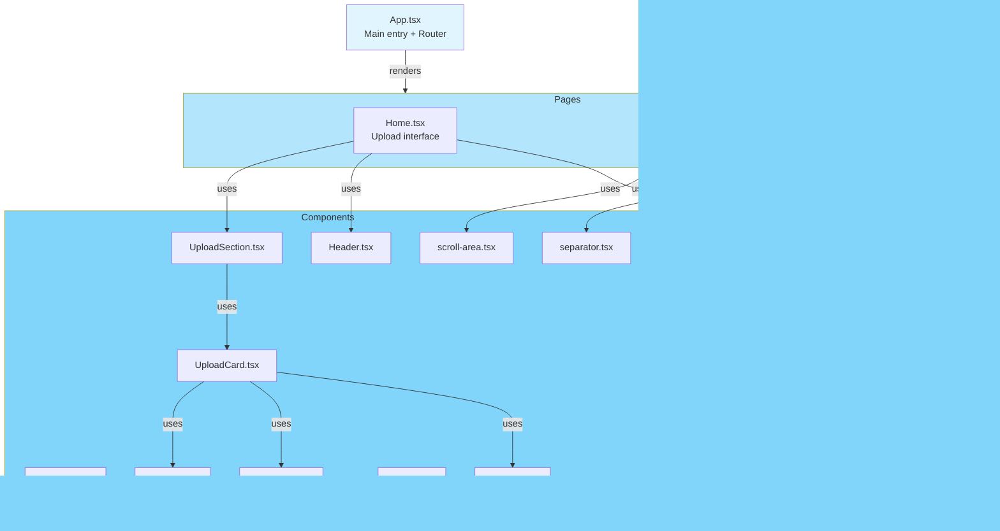
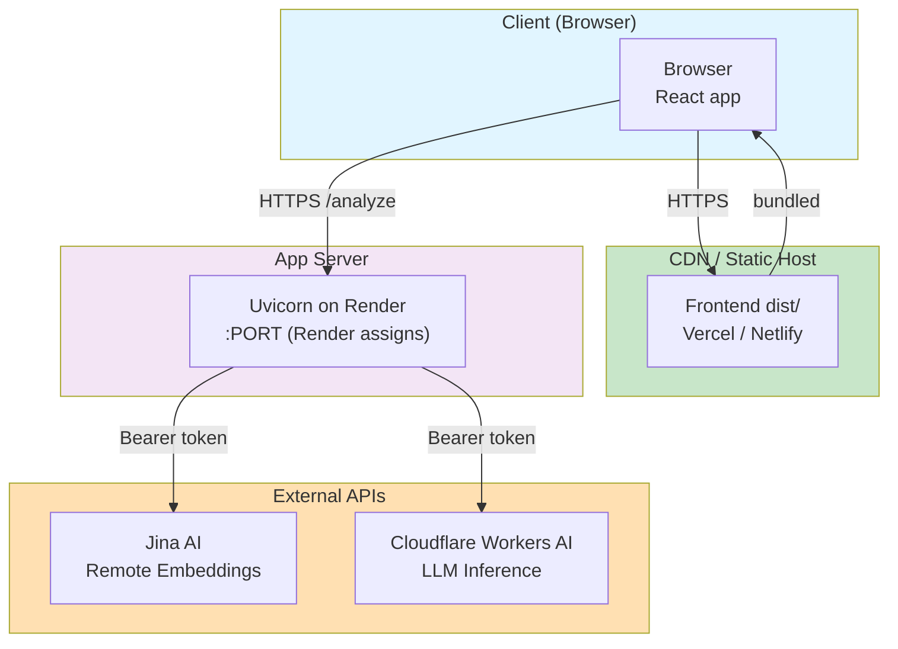

# Architecture & Workflow

This document provides visual and textual explanations of the AI Study Assistant system architecture, component interactions, and data flow.

---

## System Architecture

The application is split into three main layers: **Frontend**, **Backend**, and **External Services**.



---

## Backend Pipeline Architecture

The backend processes text through multiple stages, each handled by a dedicated module:

```mermaid
graph LR
    subgraph Input["📥 Input"]
        Text["load_text"]
        PDF["load_pdf"]
        Image["load_img"]
    end

    subgraph Preprocess["🧹 Preprocessing"]
        Clean["clean_text"]
        Chunk["chunk_text"]
    end

    subgraph Embed["🔢 Embedding & Clustering"]
        BertEmbed["embed_text<br/>Jina API"]
        Cluster["topic_classifier<br/>KMeans"]
    end

    subgraph Understand["🧠 Understanding"]
        GroupKW["group_by_labels"]
        ExtractKW["keyword_extractor"]
        DiffEst["difficulty_estimator"]
    end

    subgraph Generate["✍️ Generation"]
        Outline["generate_section_outline"]
        Context["get_section_context"]
        Content["generate_section_content"]
        Conclusion["generate_conclusion"]
    end

    subgraph PostProc["🎨 Post-Processing"]
        Dedup["dedup_facts"]
        Filter["filter_sparse"]
        Normalize["normalize_text"]
    end

    subgraph Output["📤 Output"]
        Metrics["compute_metrics"]
        Log["log_run"]
        Response["JSON Response"]
    end

    Text --> Clean
    PDF --> Clean
    Image --> Clean
    Clean --> Chunk
    Chunk --> BertEmbed
    BertEmbed --> Cluster
    Cluster --> GroupKW
    GroupKW --> ExtractKW
    ExtractKW --> DiffEst
    DiffEst --> Outline
    Outline --> Context
    Context --> Content
    Content --> Conclusion
    Conclusion --> Dedup
    Dedup --> Filter
    Filter --> Normalize
    Normalize --> Metrics
    Metrics --> Log
    Log --> Response

    %% High-contrast dark theme palette (white text friendly)
    style Input fill:#263238,stroke:#90caf9,color:#ffffff
    style Preprocess fill:#1b5e20,stroke:#a5d6a7,color:#ffffff
    style Embed fill:#4a148c,stroke:#ce93d8,color:#ffffff
    style Understand fill:#0d47a1,stroke:#90caf9,color:#ffffff
    style Generate fill:#880e4f,stroke:#f48fb1,color:#ffffff
    style PostProc fill:#33691e,stroke:#c5e1a5,color:#ffffff
    style Output fill:#004d40,stroke:#80cbc4,color:#ffffff
```



---

## Data Flow: End-to-End Request

This diagram shows how a single `/analyze` request flows through the system:



---

## Module Dependency Graph

This shows how modules depend on each other:



---

## Frontend Component Architecture

The React frontend is organized into reusable components and pages:



---

## Backend Module Responsibilities

### api/main.py
- FastAPI application setup
- CORS middleware configuration
- Health check endpoint (`GET /health`)
- Analyze endpoint (`POST /analyze`)
- Lifespan management (startup/shutdown)

### controller.py
- Orchestrates the entire pipeline
- Coordinates calls to ingestion, preprocessing, embedding, understanding, generation
- Manages data flow between stages
- Handles errors and logging

### ingestion/
- **text_loader.py**: Validates and loads raw text input
- **pdf_loader.py**: Extracts text from PDFs using PyMuPDF and OCR fallback
- **img_loader.py**: Extracts text from images using Tesseract OCR

### preprocessing/
- **cleaner.py**: Normalizes text (lowercasing, punctuation)
- **chunker.py**: Splits text into semantically meaningful chunks

### embeddings/
- **bert_embedder.py**: Calls Jina remote API to generate embeddings for chunks

### understanding/
- **topic_classifier.py**: Uses KMeans clustering to group chunks into topics
- **keyword_extractor.py**: Extracts top-k keywords per topic (NLTK stopwords)
- **difficulty_estimator.py**: Estimates difficulty level (easy/medium/hard) per topic

### generation/
- **explainer.py**: Core explanation generation logic
  - `generate_section_outline()`: LLM generates section headers
  - `get_section_context()`: Selects most relevant chunks for each section
  - `generate_section_content()`: LLM writes section content
  - `generate_conclusion()`: LLM writes summary conclusion
  - Post-processing: deduplication, filtering, normalization

### llm/
- **base.py**: Abstract `LLMClient` base class
- **factory.py**: Factory function to instantiate the correct LLM client
- **cloudfare.py**: Cloudflare Workers AI HTTP client
- **local.py**: Local GGUF model client (optional, not recommended for production)

### evaluation/
- **metrics.py**: Computes quality metrics on generated output
- **logger.py**: Logs run summaries to `run_logs.jsonl`

---

## Request Lifecycle: Detailed View

### 1. **Frontend Upload**
```
User selects input mode (text/pdf/image)
       ↓
User uploads/pastes content
       ↓
Frontend calls POST /analyze with multipart/form-data
```

### 2. **Backend Input Handling**
```
POST /analyze endpoint receives request
       ↓
LLM client is initialized (Cloudflare)
       ↓
Input is validated (input_type, content/file)
       ↓
Appropriate loader is called:
   - text_loader.load_text()
   - pdf_loader.load_pdf()
   - img_loader.load_img()
       ↓
Raw text is extracted
```

### 3. **Preprocessing**
```
cleaner.clean_text(raw_text)
       ↓
chunker.chunk_text(cleaned_text)
       ↓
List[str] chunks
```

### 4. **Embedding & Clustering**
```
bert_embedder.embed_text(chunks)
   → calls Jina API
   → returns List[List[float]] embeddings
       ↓
topic_classifier.topic_classifer(embeddings)
   → KMeans clustering
   → returns List[int] labels (one per chunk)
```

### 5. **Understanding**
```
keyword_extractor.group_by_labels(labels, chunks)
   → groups chunks by topic label
       ↓
keyword_extractor.keyword_extractor(labels, chunks)
   → extracts top-k keywords per topic
       ↓
difficulty_estimator.difficulty_estimator(topic_chunks, topic_keywords)
   → estimates difficulty per topic
```

### 6. **Generation (Per Topic)**
```
For each topic:

a) Generate outline:
   explainer.generate_section_outline(chunks, keywords, difficulty, llm)
   → LLM creates section headers

b) Select context:
   For each header:
      explainer.get_section_context(header, chunks, keywords, limit)
      → scores chunks against header
      → selects top-k chunks

c) Generate content:
   For each header:
      explainer.generate_section_content(header, context, difficulty, llm)
      → LLM writes section content

d) Generate conclusion:
   explainer.generate_conclusion(contents, headers, keywords, llm)
   → LLM writes summary

e) Post-process:
   dedup_facts_across_sections(pairs)
   dedupe_similar_sections(pairs)
   filter_sparse_sections(pairs)
   normalize_text(text)
```

### 7. **Output & Logging**
```
metrics.compute_metrics(output)
   → compute quality scores
       ↓
logger.log_run(input_text, output, evaluation)
   → writes to run_logs.jsonl
       ↓
Return JSON response to frontend
```

### 8. **Frontend Display**
```
Parse JSON response
       ↓
Extract markdown explanation for each topic
       ↓
Navigate to Output page
       ↓
Render markdown with syntax highlighting
```

---

## External Service Integration

### Jina API (Embeddings)
- **Endpoint**: `https://api.jina.ai/v1/embeddings`
- **Auth**: Bearer token in `Authorization` header
- **Input**: JSON payload with `inputs: List[str]` (text chunks)
- **Output**: JSON with embeddings vectors
- **Batching**: Configurable via `EMBEDDING_REQUEST_BATCH` (default: 16)
- **Timeout**: 60 seconds per batch

### Cloudflare Workers AI (LLM)
- **Endpoint**: `https://api.cloudflare.com/client/v4/accounts/{account_id}/ai/run/{model}`
- **Auth**: Bearer token in `Authorization` header
- **Model**: `@cf/meta/llama-3.1-8b-instruct-fp8` (default, configurable)
- **Input**: JSON with messages and parameters
- **Output**: JSON with generated text response
- **Timeout**: 60 seconds per request

---

## Environment Configuration

```env
# LLM
LLM_PROVIDER=cloudflare
CLOUDFLARE_ACCOUNT_ID=<your_account_id>
CLOUDFLARE_API_TOKEN=<your_api_token>
CLOUDFLARE_MODEL=@cf/meta/llama-3.1-8b-instruct-fp8

# Embeddings
EMBEDDING_PROVIDER=remote
JINA_API_KEY=<your_jina_api_key>
JINA_EMBEDDING_URL=https://api.jina.ai/v1/embeddings

# App
ENV=development
PORT=8000  # On Render, automatically set
```

---

## Deployment Architecture



---

## Key Design Decisions

1. **Remote Embeddings (Jina)**
   - Avoids loading heavy ML libraries (`sentence-transformers`, `torch`) on the server
   - Enables horizontal scaling
   - Reduced memory footprint

2. **Remote LLM (Cloudflare)**
   - No GPU required
   - No local model downloads
   - Instant inference

3. **Modular Pipeline**
   - Each stage can be tested independently
   - Easy to swap components (e.g., different clustering algorithms)
   - Clear separation of concerns

4. **Async/Await**
   - FastAPI handles multiple concurrent requests
   - LLM client uses async HTTP (`httpx.AsyncClient`)

5. **CORS & Security**
   - CORS middleware restricts requests to known origins
   - Environment variables store sensitive credentials
   - No hardcoded API keys

---

## Summary

The architecture is designed for:
- **Scalability**: Stateless backend, horizontal scaling
- **Reliability**: Offloaded ML to trusted providers
- **Maintainability**: Clear module boundaries, single responsibility
- **Performance**: Async operations, intelligent caching, batching

The workflow processes user input through multiple enrichment stages (cleaning, chunking, embedding, clustering, understanding) before generating a polished, study-friendly output using remote AI services.
