# Implementation and Architecture

This document describes how AI Study Assistant is implemented, how requests move through the system, and how the frontend and backend modules fit together.

## 1. System Overview

AI Study Assistant has two main applications:

- **Frontend**: a React/Vite single-page app where users choose text, PDF, or image input and view generated study notes.
- **Backend**: a FastAPI service that extracts text, processes it through an NLP pipeline, calls an LLM, and returns topic-level study notes.

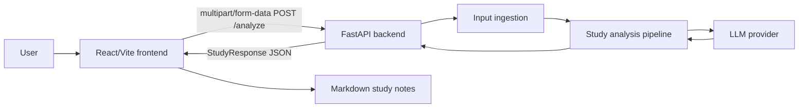

## 2. Frontend Architecture

The frontend is organized around pages, components, hooks, an API client, and shared TypeScript types.

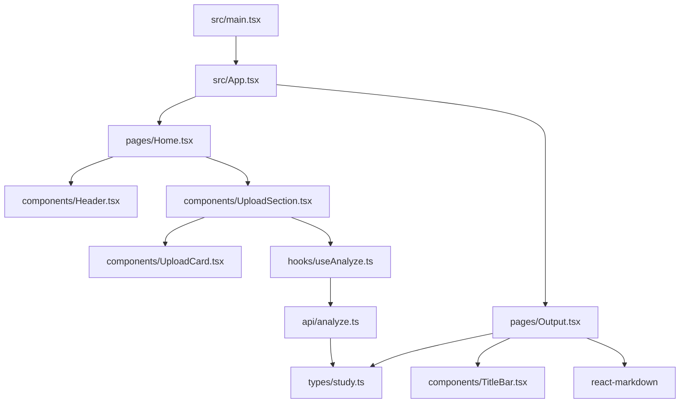

### Frontend Flow

1. `App.tsx` defines two routes: `/` and `/output`.
2. `Home.tsx` renders the header and upload/input section.
3. `UploadSection.tsx` tracks the active input type, selected file, pasted text, loading state, and errors.
4. `UploadCard.tsx` handles PDF/image file selection through hidden file inputs.
5. `useAnalyze.ts` wraps the API call with loading/error state.
6. `api/analyze.ts` builds a `FormData` payload and posts it to `${VITE_API_URL}/analyze`.
7. On success, the app navigates to `/output` with the generated result in router state.
8. `Output.tsx` renders each topic's difficulty, keywords, and Markdown explanation.

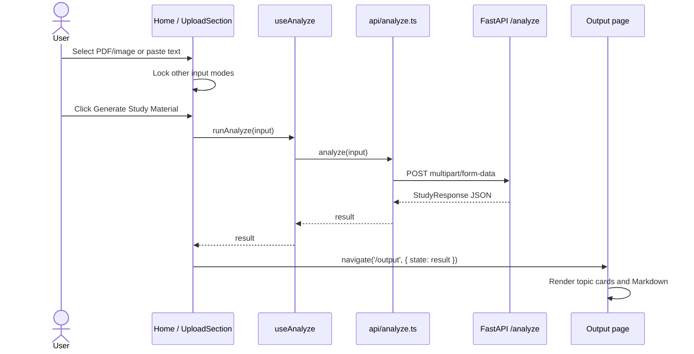

## 3. Backend Architecture

The backend follows a staged pipeline. `api/main.py` owns HTTP concerns, while `controller.py` orchestrates the NLP and generation modules.

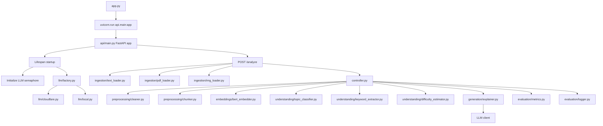

## 4. Backend Request Lifecycle

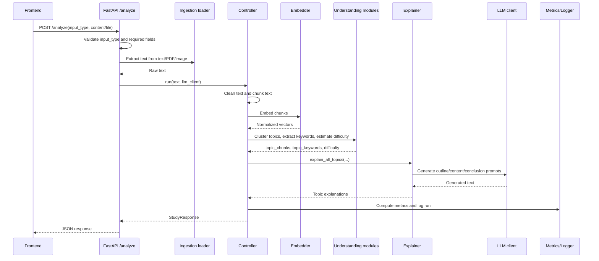

## 5. Input Ingestion

The `/analyze` endpoint accepts three input types.

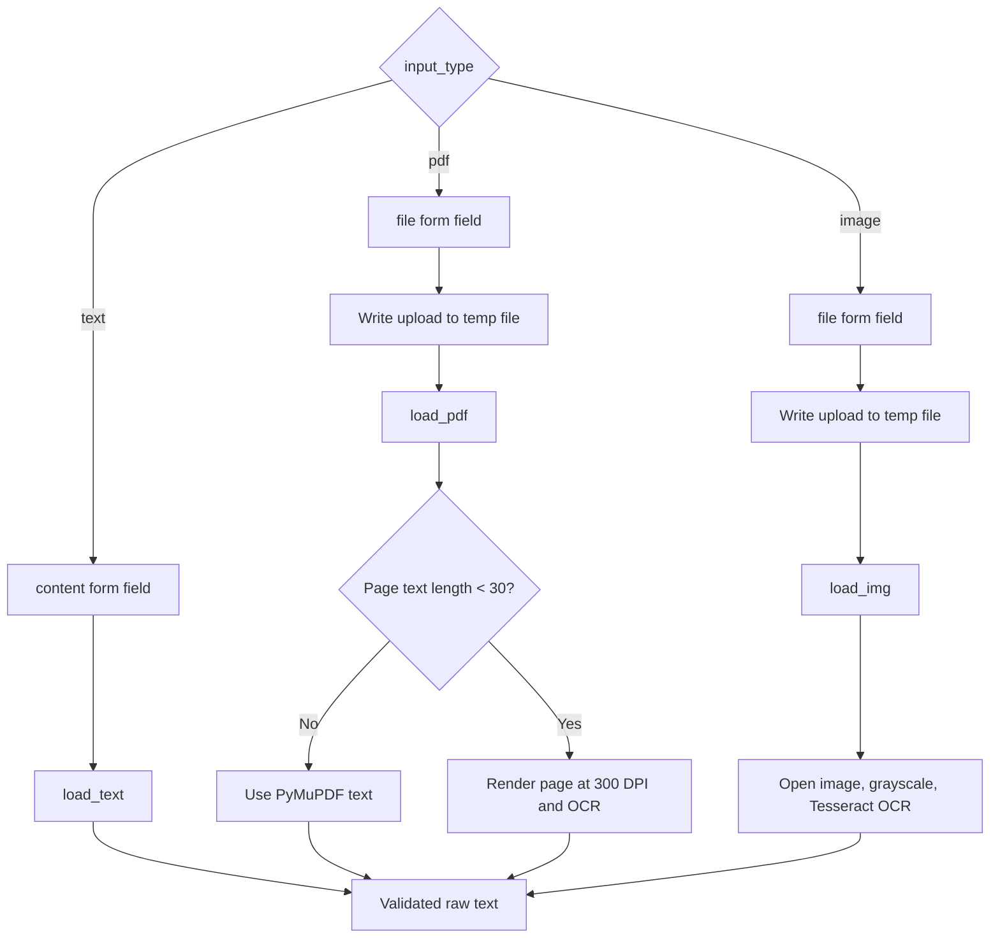

### Loader Responsibilities

| Loader | Responsibility |
| --- | --- |
| `load_text` | Validate and trim pasted text. |
| `load_pdf` | Validate PDF extension, extract page text, OCR low-text pages. |
| `load_img` | Validate image extension and run Tesseract OCR. |

## 6. Analysis Pipeline

The controller is the central backend coordinator.

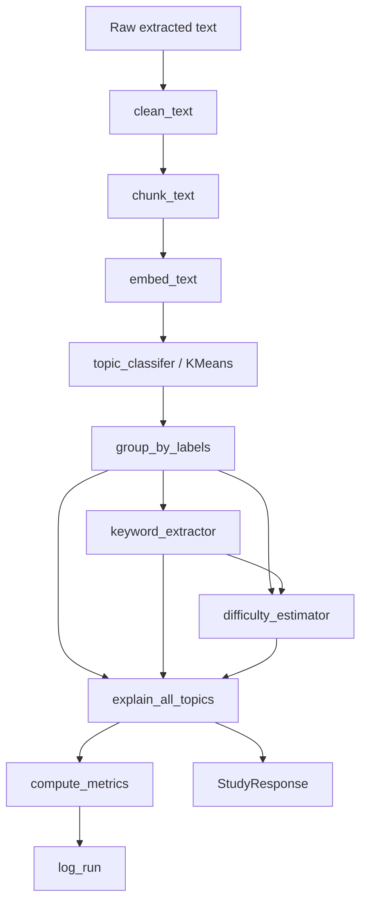

### Stage Details

| Stage | Module | Implementation detail |
| --- | --- | --- |
| Cleaning | `preprocessing/cleaner.py` | Strips whitespace, normalizes hidden spaces, lowercases text. |
| Chunking | `preprocessing/chunker.py` | Groups paragraphs into chunks up to a default size of 800 characters. |
| Embedding | `embeddings/bert_embedder.py` | Loads `sentence-transformers/all-MiniLM-L6-v2` once and encodes chunks in batches. |
| Topic clustering | `understanding/topic_classifier.py` | Uses KMeans; cluster count scales with the number of chunks. |
| Grouping | `understanding/keyword_extractor.py` | Maps cluster labels to chunk lists. |
| Keyword extraction | `understanding/keyword_extractor.py` | Removes stopwords, filters short words, ranks by frequency. |
| Difficulty estimation | `understanding/difficulty_estimator.py` | Scores keyword length, average chunk length, and topic breadth. |
| Generation | `generation/explainer.py` | Builds outlines, selects section context, prompts the LLM, deduplicates content, and returns Markdown. |
| Evaluation | `evaluation/metrics.py` | Measures word count, keyword coverage, and expected length fit. |
| Logging | `evaluation/logger.py` | Appends summary metrics to `run_logs.jsonl`. |

## 7. Topic Clustering Strategy

The topic classifier chooses the number of clusters from the number of chunks.

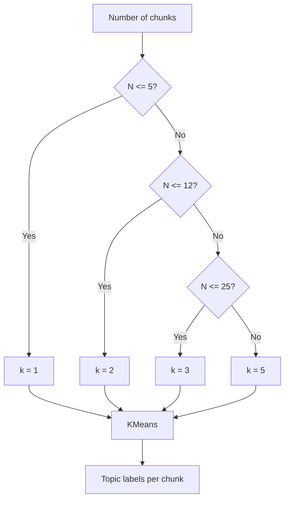

## 8. Difficulty Estimation

Difficulty is heuristic rather than model-generated. For each topic:

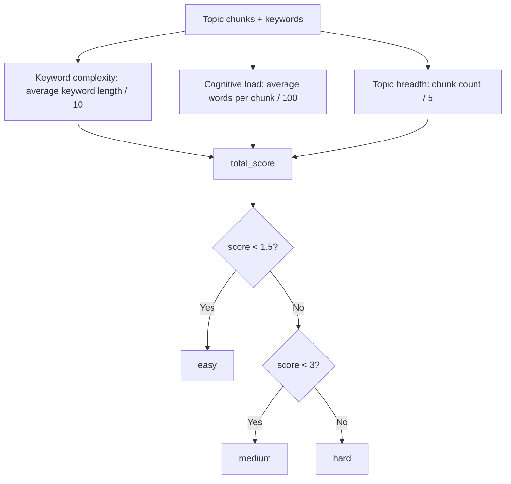

## 9. LLM Provider Architecture

The LLM layer is designed around a common client abstraction and a factory.

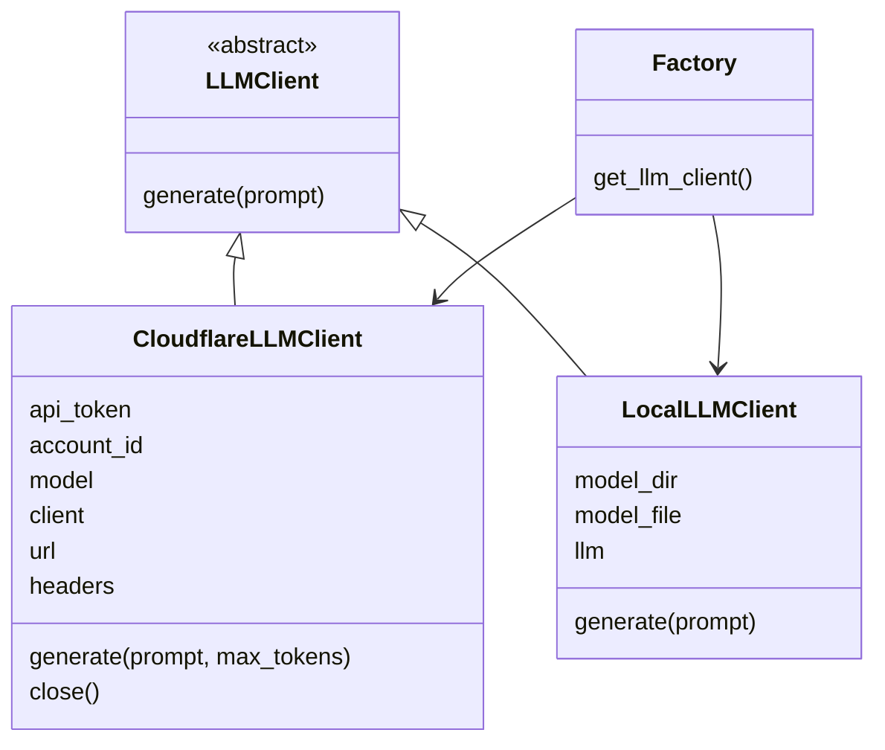

### Provider Selection

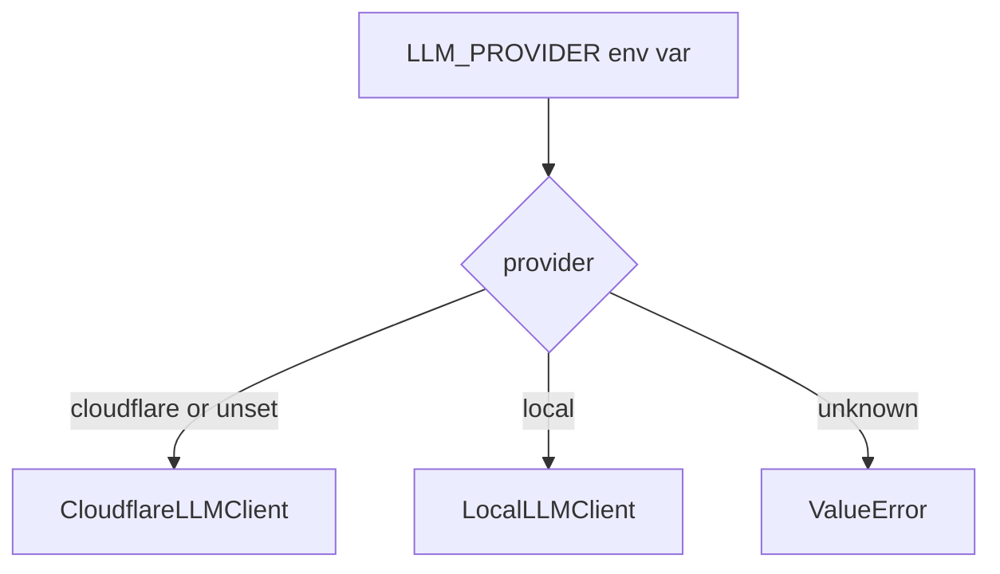

The FastAPI lifespan initializes one shared LLM client and stores it on `app.state.llm_client`. It also initializes a global semaphore in the explainer module to limit concurrent LLM calls.

## 10. Explanation Generation

The explainer is the most detailed part of the backend. It generates notes topic by topic and section by section.

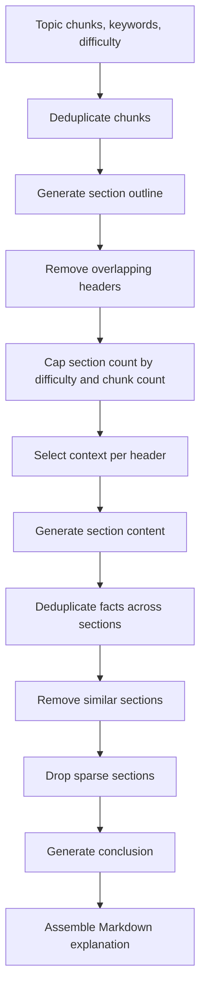

### Generation Substeps

1. **Chunk deduplication** removes repeated source chunks.
2. **Outline generation** asks the LLM for mutually exclusive Markdown section headers.
3. **Header cleanup** removes overlapping headers and guarantees a conclusion section.
4. **Section count capping** adapts the maximum number of body sections to topic difficulty.
5. **Context selection** scores chunks against each header, keywords, semantic hints, and reuse penalties.
6. **Section generation** prompts the LLM to write only facts explicitly found in the selected context.
7. **Pair-safe post-processing** keeps headers and generated content aligned while removing duplicate facts and sparse sections.
8. **Conclusion generation** summarizes the actually retained sections.
9. **Markdown assembly** returns the final topic explanation.

## 11. Response Contract

The backend returns a record keyed by topic label. Each topic includes difficulty, keywords, and a Markdown explanation.

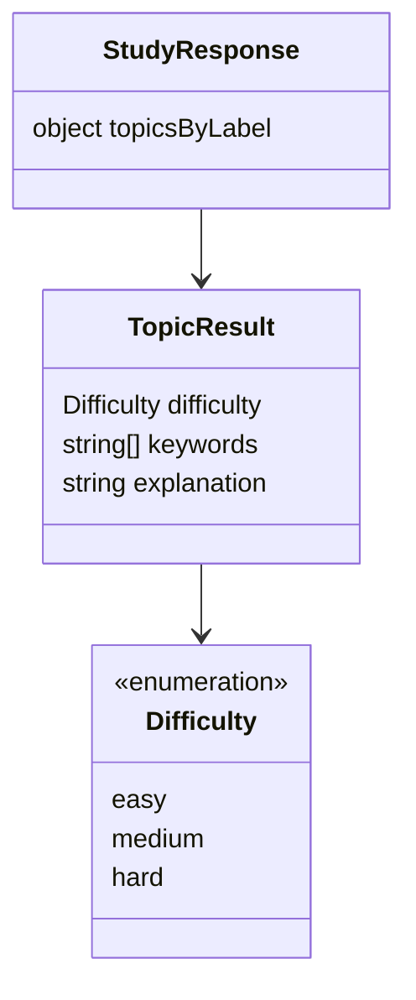

Example:

```json
{
  "0": {
    "difficulty": "easy",
    "keywords": ["graph", "nodes", "edges"],
    "explanation": "## Nodes and Edges\n...\n\n## Conclusion\n..."
  }
}
```

## 12. Evaluation and Logging

After generation, the backend computes lightweight quality metrics.

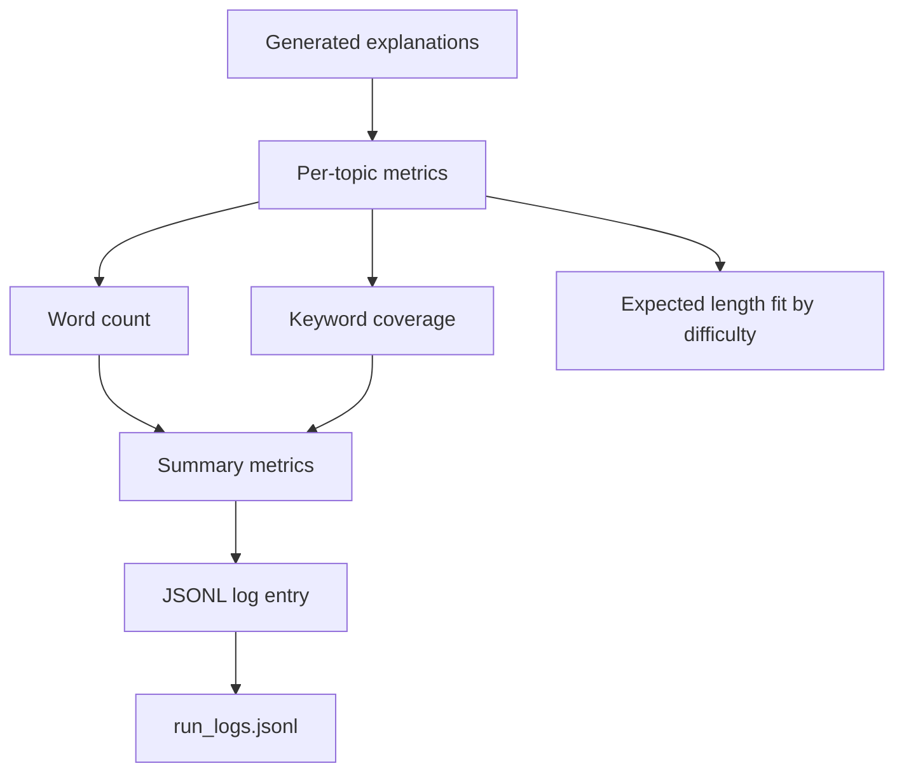

Logged fields include:

- UTC timestamp
- input length in characters
- number of topics
- metrics summary

## 13. Error Handling

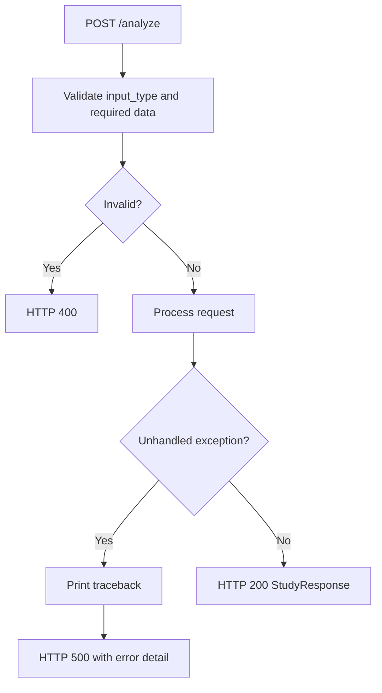

The API raises `HTTPException` for invalid input and catches unexpected errors to return a 500 response with diagnostic detail.

## 14. Important Implementation Notes

- Backend startup happens in the FastAPI lifespan hook, which initializes both the LLM semaphore and shared LLM client.
- Uploaded files are written to temporary files because the PDF and image loaders operate on filesystem paths.
- Temporary upload files are deleted in a `finally` block after extraction.
- Topic labels are generated by KMeans and are not stable semantic names.
- The frontend stores the response in React Router navigation state; refreshing `/output` without state redirects back to `/`.
- The Cloudflare LLM client is asynchronous and includes a `close()` method for FastAPI shutdown.
- The generation pipeline defaults to sequential section generation within each topic to reduce repeated facts.

## 15. Opportunities for Improvement

- Add human-readable topic titles separate from numeric cluster labels.
- Fix text normalization regexes so OCR whitespace cleanup uses `\n+` and `\s+` patterns instead of literal slash patterns.
- Make the local LLM client async-compatible with the Cloudflare client signature.
- Add source-grounded citations from chunks to generated sections.
- Improve keyword extraction with n-grams or TF-IDF.
- Persist analysis jobs and output instead of passing results only through router state.
- Add automated backend tests and frontend component tests.
- Add production CORS and deployment-specific environment configuration.
